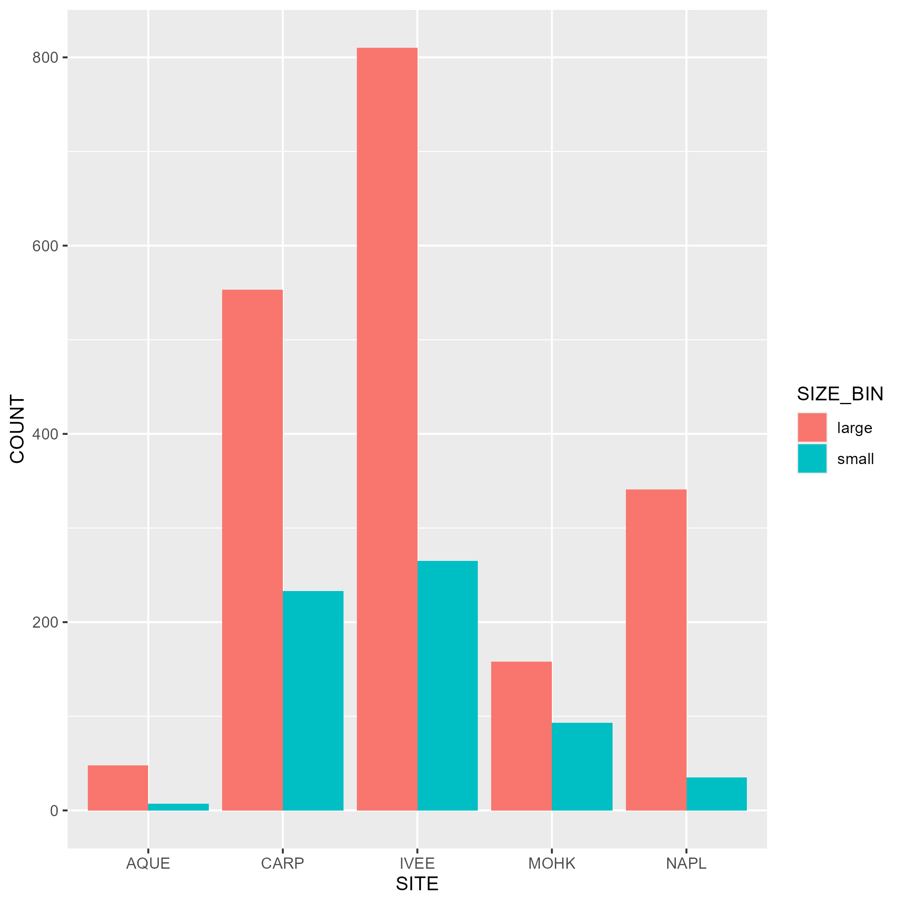

## Data

The data was downloaded on 4/20/2026 from https://portal.edirepository.org/nis/mapbrowse?packageid=knb-lter-sbc.77.8. It is provided from the Santa Barbara Coastal Long Term Ecological Research (SBC LTER).

## Abstract Summary

This data tracks abundance, size, and fishing pressure of California spiny lobster along the Santa Barbara Channel, including sites inside and outside marine protected areas established in 2012. It supports studying how fishing impacts kelp forest ecosystems using diver surveys and trap counts collected annually and throughout the fishing season.

## Owner Analysis

{fig-alt = "Plot showing the lobster count per year for each location"}

{fig-alt = "Plot showing the lobster count by size classification for each location"}

## Collaborator Analysis

{fig-alt = "Plot showing the lobster count per site with two bars, one being high pressure and one being low pressure."}

## Summary

We learned that overall, when fishing pressure is low, there is a higher amount of lobster observed. When fishing pressure is high, the CARP site, which already abundant number of lobsters was less affected, leaving more lobsters observed. However, in the IVEE site, which has the highest overal abundance over the years, there were no lobsters observed in high fishing pressure. This is interesting because despite both having high abundance of lobsters, fishing pressure effected the lobsters observed unequally.
