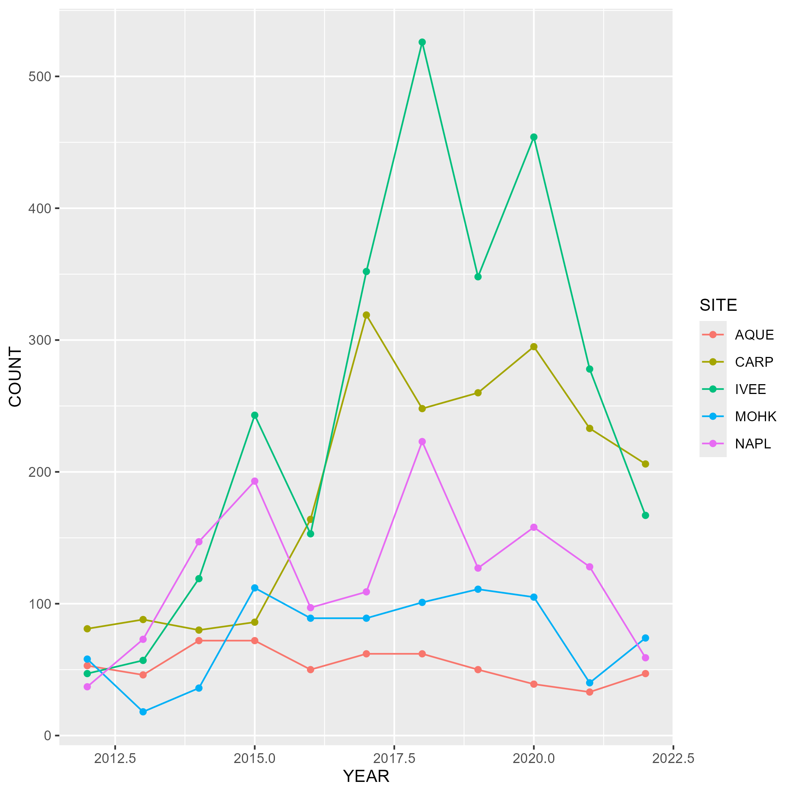
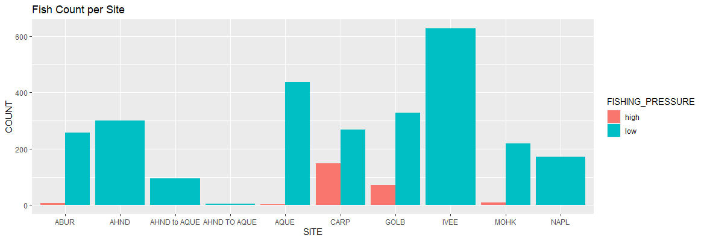

## Data

The data was downloaded on 4/20/2026 from https://portal.edirepository.org/nis/mapbrowse?packageid=knb-lter-sbc.77.8. It is provided from the Santa Barbara Coastal Long Term Ecological Research (SBC LTER).

## Abstract Summary

This data tracks abundance, size, and fishing pressure of California spiny lobster along the Santa Barbara Channel, including sites inside and outside marine protected areas established in 2012. It supports studying how fishing impacts kelp forest ecosystems using diver surveys and trap counts collected annually and throughout the fishing season.

## Owner Analysis

{fig-alt="Plot showing the lobster count per year for each location"}

<<<<<<< HEAD
# Collaborator Analysis

```{r}
count_by_size_per_pressure.png


```

# Summary
=======
## Collaborator Analysis
{fig-alt = "Plot showing the lobster count per site with two bars, one being high pressure and one being low pressure."}


## Summary
>>>>>>> a34a4e7256e98c637e0c3a15cf906a2d2b749bcd
